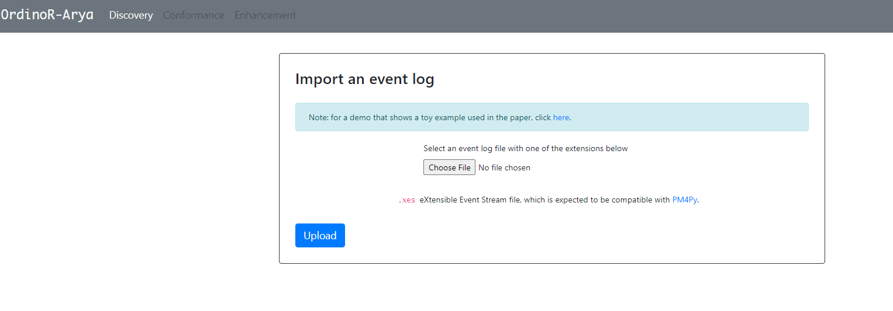
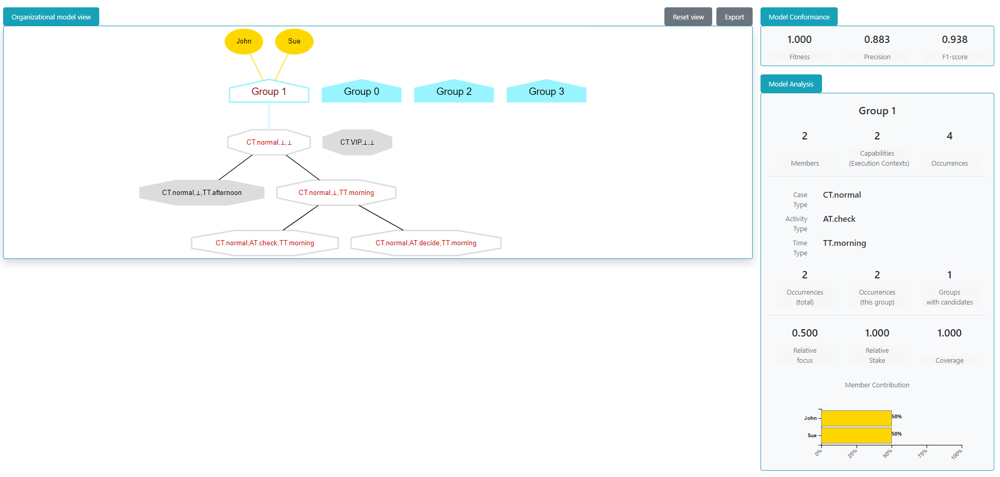

.. _examples_2021arya:

"Arya": Web-based Tool for Organizational Model Mining
======================================================

.. hint::
   An live demo can be found at https://ordinor.herokuapp.com/,
   which presents the toy example as shown in the manuscript without
   installing *OrdinoR*.

This page introduces an interactive tool developed as a webapp for
performing organizational model mining and visualization.
Source code of the tool can be found in a 
`GitHub repository <https://github.com/roy-jingyang/OrdinoR-Arya>`_.

.. note::
   Before proceeding, make sure that *OrdinoR* has been installed.
   (:ref:`How to install? <install>`)

How to Use
----------

Download
^^^^^^^^
Download and extract the bundled zip from
`this link <https://github.com/roy-jingyang/OrdinoR-Arya/archive/refs/heads/master.zip>`_, 
in which you would find the following files and folder:

.. code-block:: bash

    .
    ├── arya
    ├── LICENSE
    ├── README.md
    └── run.py

The main Python program ``run.py`` helps you start the webapp. The source 
code files are contained in folder ``arya/``.

Run the Program
^^^^^^^^^^^^^^^
To use the demo, 

1. Go to the working folder and run the program with the following
   command

.. code-block:: bash

   python run.py

You should be able to see messages similar to the following:

.. code-block:: bash

   * Serving Flask app 'arya' (lazy loading)
   * Environment: production
   WARNING: This is a development server. Do not use it in a production deployment.
   Use a production WSGI server instead.
   * Debug mode: on
   * Running on all addresses.
   WARNING: This is a development server. Do not use it in a production deployment.
   * Running on http://10.0.2.15:5000/ (Press CTRL+C to quit)
   * Restarting with watchdog (inotify)
   * Debugger is active!
   * Debugger PIN: 732-722-181

2. Head over to `<http://localhost:5000/>`_ in the web browser to access
   the demo. You should be able to see a webpage like the following.
   |fig:index|

3. Import an event log, specify and configure the methods for 
   organizational model discovery. Then click on "Discover model".

4. Visualization of the discovered model will be presented after the
   discovery procedure succeeds. You can view the details of a discovered
   organizational model by doing:

   * **single-click on a group** shows the group members;
   * **double-click on a group** shows the execution contexts in which
     the group capabilities are highlighted;
   * **double-click on an execution context** expands its wild-card ("⊥") 
     and shows related execution contexts.
     |fig:vis|

   The model evaluation and analysis information is shown in the right
   panel.

.. note::
    Model discovery and visualization rendering may take some time to
    finish (especially for large-scale event logs). Please wait and do
    not refresh the web page during the procedure.

Report Issues
-------------
Please use the `GitHub Issues page
<https://github.com/roy-jingyang/OrdinoR-Arya/issues>`_.
