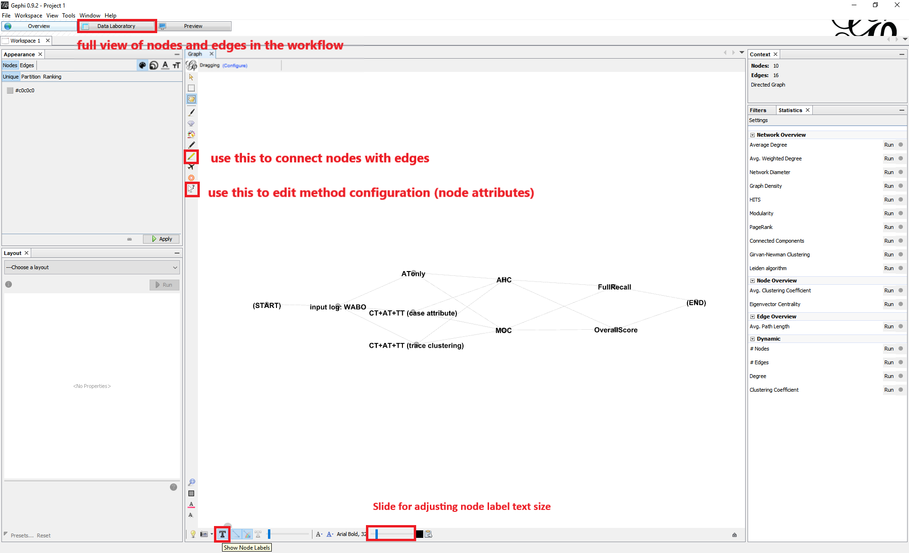
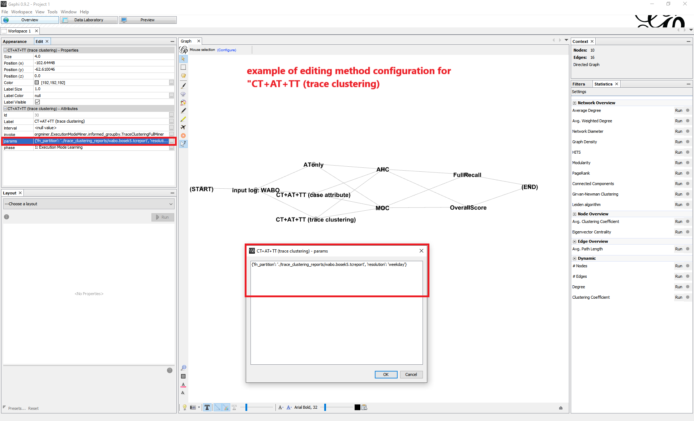

.. _examples_2021om2-experiments:

Replicate the Experiments for Validation
========================================

This page provides a guide to replicate the experiments on Model
Evaluation and Comparison in the *OrdinoR* framework paper.

.. note::
   Before proceeding, make sure that *OrdinoR* has been installed.
   (:ref:`How to install? <install>`)

How to Use
----------

Download
^^^^^^^^
Download and extract the bundled zip from 
`<https://github.com/roy-jingyang/Org-om2_experiments/archive/refs/heads/master.zip>`_,
**navigate to folder** ``experiment/``, in which you will find the 
following files and folders:

.. code-block:: bash

    .
    ├── batch.py
    ├── configs
    │   ├── bpic17.graphml
    │   └── wabo.graphml
    ├── data.zip
    ├── execute.py
    └── trace_clustering_reports
        ├── bpic17.bosek14.tcreport
        └── wabo.bosek5.tcreport

File ``data.zip`` contains the two event logs used in the experiments.
Folder ``configs/`` contains the configuration files with respect to the
two logs. 
Folder ``trace_clustering_reports/`` contains the trace clustering results
generated from applying the Context Aware Trace Clustering technique
[bose2009]_ ("Guide Tree Miner" in `ProM 6
<http://www.promtools.org/doku.php>`_), prepared for the experiments.

Follow the steps below to conduct the experiments.

1. Prepare the experiment dataset
^^^^^^^^^^^^^^^^^^^^^^^^^^^^^^^^^
Extract ``data.zip`` under the current folder.

.. code-block:: bash

    data/
    ├── bpic17.xes
    └── wabo.xes

Note that these log files have been preprocessed accordingly, as
described in the manuscript.

2. (Optional) Edit the experiment setup
^^^^^^^^^^^^^^^^^^^^^^^^^^^^^^^^^^^^^^^
Navigate to folder ``configs/``, you will find two configuration files:

.. code-block:: bash

    configs/
    ├── bpic17.graphml
    └── wabo.graphml

You can choose to view and edit the configuration files with 
diagramming. To do so, we recommend using 
`Gephi <https://gephi.org/>`_ (other graph visualization software should 
suffice as long as it supports the 
`GraphML format <https://gephi.org/users/supported-graph-formats/graphml-format/>`_ 
used for recording the configuration):

1. Load a configuration file with extension ``.graphml`` using Gephi.
2. (Optional) Toggle on "Show Node Labels" (by clicking on the **T** 
   button on the bottom-left corner) for better visualization.
   |fig:overview|
3. Edit the edge connections to determine which methods should be 
   combined for model discovery.
4. View and edit the parameter settings for each of the methods as node 
   attributes. For a brief instruction on how to alter the parameter 
   values, refer to :ref:`examples_2021om2-experiments_appendix`.
   |fig:edit|
5. Use "File->Export->Graph file" to save the new configuration file as 
   GraphML format. 
   |fig:export|

.. |fig:export| image:: 2021om2_gephi_overview-export.png
   :align: middle

3. Run the experiments
^^^^^^^^^^^^^^^^^^^^^^

.. note::
    Due to the grid search procedure and cross-validation used in the
    experiments, a long computation time is expected depending on the
    computer power. This is especially the case for log "BPIC17" in the
    dataset with 475,306 events.

Go to the working folder and run the program with the following command

``python batch.py ./configs/wabo.graphml [<path_to_output_folder>]``

with path to the output folder specified accordingly.

Change the filename to ``bpic17.graphml`` to run the experiments on
another event log.

4. Check the experiment results
^^^^^^^^^^^^^^^^^^^^^^^^^^^^^^^^^
The experiments will be conducted automatically according to the 
configuration file provided. After completion, you may find two types of 
files under the specified output folder:

* ``*.om``, a discovered organizational model. The filename shows the
  corresponding methods used for discovering this model.
* ``.*_report.csv``, model evaluation results of a discovered model.

.. _examples_2021om2-experiments_appendix:

Appendix: Alter the parameter settings
^^^^^^^^^^^^^^^^^^^^^^^^^^^^^^^^^^^^^^

For **input event log**, the following parameter can be configured:

* ``filepath``: a string specifying the path to the input event log file 
  in IEEE XES format.

For **Execution Context Learning** methods,

* ATonly: nothing to configurable.
* CT+AT+TT (case attribute):

    * ``case_attr_name``, a string specifying a case-level attribute in 
      the log used for deriving case types.
    * ``resolution``, a value of {``'hour'``, ``'day'``, ``'weekday'``}
      specifying a time unit used for deriving time types.

* CT+AT+TT (trace clustering):
    
    * ``fn_partition``, a string specifying the path to a file 
      containing the trace clustering results on the input log.
    * ``resolution``, a value of {``'hour'``, ``'day'``, ``'weekday'``}
      specifying a time unit used for deriving time types.

For **Resource Grouping discovery** methods,

* AHC:

    * ``n_groups``: a string in the format ``list(range(x, y))`` 
      specifying the range of possible number of resource groups to be 
      searched. Substitute ``x`` and ``y`` with actual integers desired. 
      Note that the range is defined as ``[x, y)``, i.e., non-inclusive on 
      the right side.
    * ``method``, a value of {``'ward'``, ``'complete'``, ``'average'``, 
      ``'single'``} specifying the linkage criterion. See 
      `Scikit-learn AHC method <https://scikit-learn.org/stable/modules/clustering.html#hierarchical-clustering>`_ 
      for a reference.
    * ``metric``, a value of {``'euclidean'``, ``'cosine'``, 
      ``'correlation'``} specifying the distance metric.

* MOC:

    * ``n_groups``: a string in the format ``list(range(x, y))`` 
      specifying the range of possible number of resource groups to be 
      searched. Substitute ``x`` and ``y`` with actual integers desired. 
      Note that the range is defined as ``[x, y)``, i.e., non-inclusive on 
      the right side.

    * ``init``: a value of {``'random'``, ``'kmeans'``} specifying the 
      strategy used for initializing the parameters of MOC. With 
      ``'random'``, a random initialization with 100 runs is used; with 
      ``'kmeans'``, the seed is derived from first applying the kMeans 
      algorithm.

For **Resource Group Profiling** methods,

* FullRecall: nothing to configure.
* OverallScore:

    * ``w1``: a float number in range (0, 1) specifying the weighting 
      assigned to Group Relative Stake. When given, the weighting value 
      assigned to Group Coverage will be determined consequently as they 
      sum up to 1.0.

    * ``p``: a float number in range (0, 1) specifying the threshold 
      value.
    
    * ``auto_search``: a Boolean value, i.e., ``True`` or ``False``, 
      specifying whether or not to automatically determine the weighting 
      values and threshold value applying grid search strategy. If 
      ``True``, i.e., to use auto-search, then values given to 
      ``'w1'`` and ``'p'`` will be overridden.

Report Issues
-------------
Please use the `GitHub Issues page
<https://github.com/roy-jingyang/Org-om2_experiments/issues>`_.
