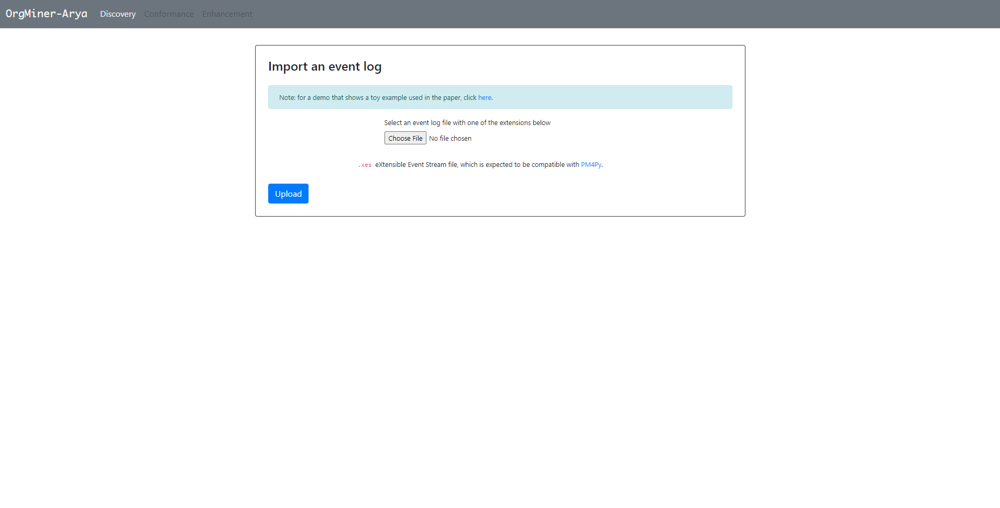
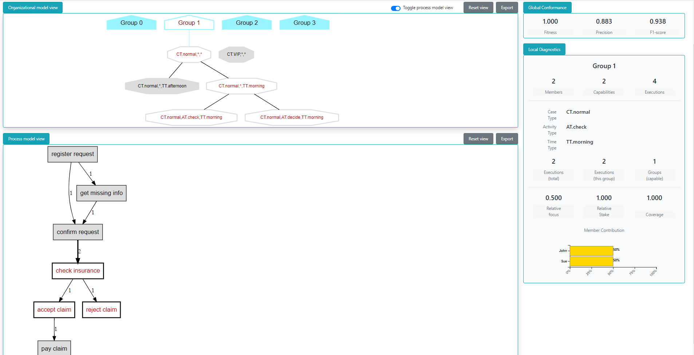

.. _examples_infsyst2020yang-arya:

"OrgMining 2.0": an interactive demo
====================================

This page presents an interactive demo developed as a simple client-server 
application, for performing organizational model discovery and 
visualizing the produced models.

Source code of the demo can be found in a 
`GitHub repository <https://github.com/roy-jingyang/OrgMiner-Arya>`_.

.. note::
   Before proceeding, make sure you have installed OrgMiner with the 
   optional packages for "Arya" on your machine. 
   (:ref:`How to install? <install>`)

How to Use
----------

Download and extract the bundled zip from
`HERE <https://github.com/roy-jingyang/OrgMiner-Arya/archive/master.zip>`_, 
in which you would find the following files:

.. code-block:: bash

    .
    ├── arya
    │   ├── app.py
    │   ├── static
    │   ├── templates
    │   └── tmp
    ├── LICENSE
    ├── README.md
    ├── run.bat
    └── run.sh

The batch script ``run.bat`` (or the shell script ``run.sh`` for 
Unix-like systems) helps you to start the app more conveniently. The 
source code files are contained within folder ``arya``.

To use the demo,

1. Open an 
   `Anaconda Prompt <https://docs.anaconda.com/anaconda/user-guide/getting-started/#open-anaconda-prompt>`_ 
   (or the terminal for Unix-like systems)
2. Change to the root directory of the extracted files, and then execute 
   the batch (shell) script. You should see the prompting information as 
   follows:

.. code-block:: bash

    * Serving Flask app "./arya/app.py" (lazy loading)
    * Environment: production
    WARNING: This is a development server. Do not use it in a production deployment.
    Use a production WSGI server instead.
    * Debug mode: on
    * Running on http://0.0.0.0:5000/ (Press CTRL+C to quit)
    ...

3. Then head over to `<http://0.0.0.0:5000/>`_ in the web browser to 
   access the demo. You should see a webpage like the following.
   |fig:index|
4. Import an event log, specify and configure the methods for 
   organizational model discovery. Then click on "Discovery".
5. The visualization of the model will be presented when the discovery 
   procedure succeeds. You can view the details using the following 
   actions:

   * **single-click on a group** shows the group members' resource ID;
   * **double-click on a group** shows execution modes in which the 
     group capabilities are highlighted;
   * **double-click on an execution mode** expands its wild-card ("*") 
     and shows related execution modes (so do the highlight capability 
     nodes). When the action expands to activity types level, a process 
     model (as a Directly-Follows Graph) will be shown for which the 
     events correspond to the selected case type.
     |fig:vis|

.. note::
    Please allow some time for discovering a model and rendering the 
    visualization (especially when a large event log is being used), and 
    *do not refresh* the webpage during the procedure.

Future work
-----------

The Arya program is quite naive and was developed for demonstration 
purpose for the paper [yang2020]_ only (mainly for "visualizing" an 
organizational model with certain interaction allowed). Hence it is not 
meant to be a well-designed and -developed web application. 

In future work we would either 

* continue to upgrade the application and try to develop a web service, 
  or
* adopt other solutions for visualization purpose.

The current page will be updated should there be any changes to the demo 
"Arya".

